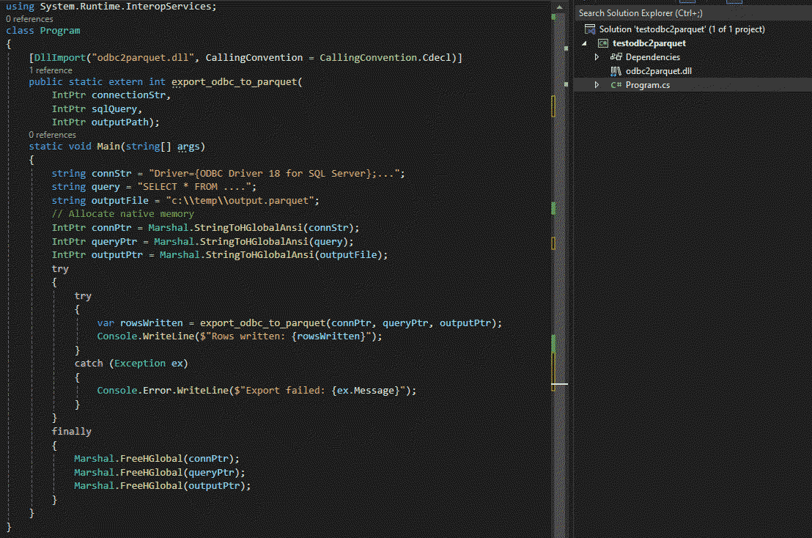

# ODBC to Parquet dll

A DLL version of the command line tool that can be used by .Net, Java etc. The function returns the row number exported which is useful to determine if the file is empty. 

* Small memory footprint. Only holds one batch at a time in memory.
* Fast. Makes efficient use of ODBC bulk reads, to lower IO overhead.
* Flexible. Query any ODBC data source you have a driver for. MySQL, MS SQL, Excel, ...

## Mapping of types in queries

The tool queries the ODBC Data source for type information and maps it to parquet type as such:

| ODBC SQL Type              | Parquet Type                 |
|----------------------------|------------------------------|
| Decimal(p < 39, s)         | Decimal(p,s)                 |
| Numeric(p < 39, s)         | Decimal(p,s)                 |
| Bit                        | Boolean                      |
| Double                     | Double                       |
| Real                       | Float                        |
| Float(p: 0..24)            | Float                        |
| Float(p >= 25)             | Double                       |
| Tiny Integer Signed        | Int8 Signed                  |
| Tiny Integer Unsigned      | Int8 Unsigned                |
| Small Integer              | Int16                        |
| Integer                    | Int32                        |
| Big Int                    | Int64                        |
| Date                       | Date                         |
| Time(p: 0..3)*             | Time Milliseconds            |
| Time(p: 4..6)*             | Time Microseconds            |
| Time(p: 7..9)*             | Time Nanoseconds             |
| Timestamp(p: 0..3)         | Timestamp Milliseconds       |
| Timestamp(p: 4..6)         | Timestamp Microseconds       |
| Timestamp(p >= 7)          | Timestamp Nanoseconds        |
| Datetimeoffset(p: 0..3)    | Timestamp Milliseconds (UTC) |
| Datetimeoffset(p: 4..6)    | Timestamp Microseconds (UTC) |
| Datetimeoffset(p >= 7)     | Timestamp Nanoseconds (UTC)  |
| Varbinary                  | Byte Array                   |
| Long Varbinary             | Byte Array                   |
| Binary                     | Fixed Length Byte Array      |
| All others                 | Utf8 Byte Array              |

`p` is short for `precision`. `s` is short for `scale`. Intervals are inclusive.
* Time is only supported for Microsoft SQL Server

### Prerequisites

To work with this tool you need an ODBC driver manager and an ODBC driver for the data source you want to access.

### Download Library from GitHub

<https://github.com/waynetheron/Odbc2parquet-dll/releases/latest>

*Note*: Download the 32 Bit version if you want to connect to data sources using 32 Bit drivers and download the 64 Bit version if you want to connect via 64 Bit drivers. It won't work vice versa.
